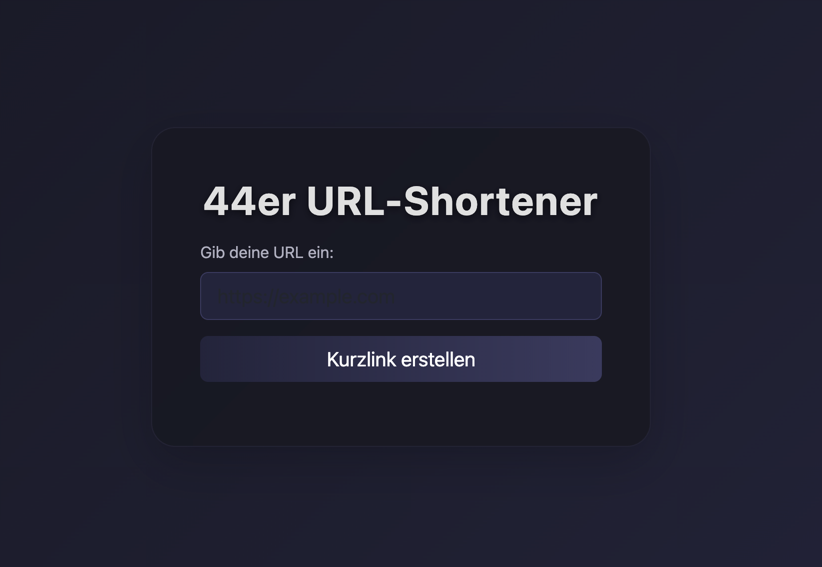
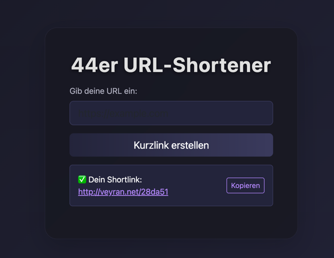

# 44er URL-Shortener 🚀


**44er URL-Shortener** ist ein **moderner, sicherer und performanter URL-Kürzer**, geschrieben in **PHP 8+**, mit **PDO**, **Bootstrap 5.3** und **Clipboard-Unterstützung**.

---

## 🌟 Live Demo

[url-shortener.veyran.net](https://url-shortener.veyran.net)

- Einfach URL eingeben
- Klick auf „Kurzlink erstellen“
- Shortlink kopieren und teilen

---

## ⚡ Features

- ✅ **Sicher vor SQL Injection** (PDO + Prepared Statements)
- ✅ **Validierte URLs** – keine ungültigen Links
- ✅ **Kurze alphanumerische Codes** (6 Zeichen)
- ✅ **Duplicate Prevention** – gleiche URL → gleiche Shortcodes
- ✅ **Responsive Design** dank Bootstrap 5.3
- ✅ **Kopier-Button** für Shortlinks
- ✅ **Vollständig objektorientiert**

---

## 🖼 Screenshots

  


---

## 🛠 Installation

1. Repository klonen:

```bash
git clone https://github.com/DeinUsername/url-shortener.git

